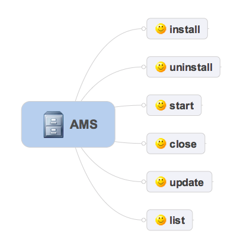
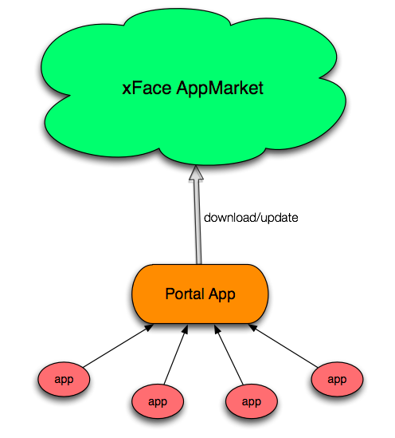

#xFace Application Management System

##What is AMS
xFace offers a running mode for multiple apps. Typically there is a superior app which's responsible for all other managed applications. Let's simply call this superior app as "Portal". Only Portal can be authorized AMS permission. 

Basically AMS offers a set of interfaces to manage apps as following,

##AMS with App Market

With a back-end app market service, the Portal can ask for the market to get information, download, install or update apps with desire. Next figure outlines the entire circle, 

The whole solution of AMS with one sophisticated market provides an ability to build your own app ecosystem. Here's a screenshot of our Portal app,

