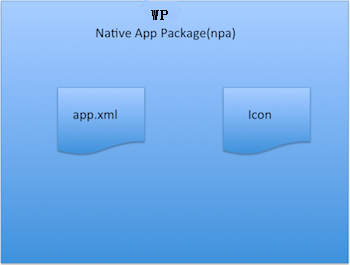
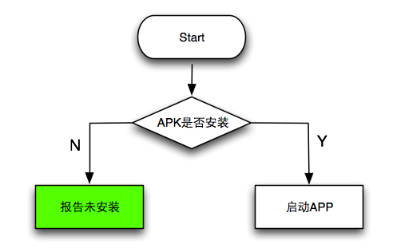
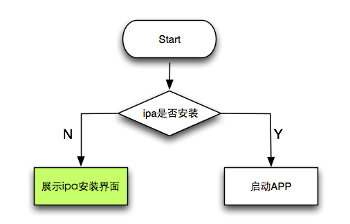
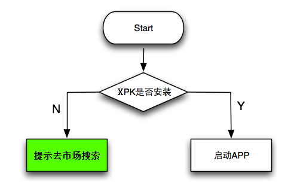

* Auto-generated toc
{:toc}

xFace除了可以管理xFace application，也可以管理Native Application，但两种环境略有差异。

##简介
由于运行平台的限制，xFace并不能直接管理native app，因此xFace抽象出了npa格式 (native package archive)，AMS实际管理的也是npa。可以这样理解，npa是native app在xFace系统中对应的shadow app，xFace通过操作npa实现对native app的间接安装、启动、卸载等。

xFace application的打包格式为xpa (xFace package archive)，而接受xFace管理的native application，则必须打包为npa格式。

##npa包

* app.icon **必需**, native app的图标
* app.xml **必需**, native app的描述信息文件
* native app package **可选**, 仅仅Android支持，即apk

xFace根据npa提供的信息，安装、启动、卸载其对应的native app

##app.xml
npa中的app.xml和xpa的app.xml基本一致，不同处参考下面,

    <config schema="1.0">
        <!-- app标签；id属性指应用id，应用的唯一标识符，不同应用id必须不同-->
        <app id="ResizeImage">
             <description>
                 <type>napp</type>
                 <entry src="ResizeImage-photoapplink://"/>                     
                 
                 <preference name="remote-pkg"  value="http://itunes.apple.com/app/id409547517?mt=8&amp;partnerId=30&amp;tduid=voTw02jXldU"  readonly="true"/>     
              </description>
        </app>
    </config>
{:lang="xml"}

1. **type** 标记native app类型，这里必须是*napp*
2. **entry** 启动native app的参数
    * **Android** app package name
    * **iOS** custom scheme url，请参考[Communicating with Other Apps](http://developer.apple.com/library/ios/#documentation/iphone/conceptual/iphoneosprogrammingguide/AdvancedAppTricks/AdvancedAppTricks.html) 或 [Can I extract the Custom URL Scheme from a .ipa file?](http://stackoverflow.com/questions/6845693/can-i-extract-the-custom-url-scheme-from-a-ipa-file)
    * **WP** custom scheme url，与ios类似
3. **remote-pkg** 提供native app安装信息
    * **Android** 该字段无效
    * **iOS** 可能是一个appstore url，也可能是[企业app发布页面](http://my.oschina.net/rareliu/blog/28443) url
    * **WP**  该字段目前无效

##支持的API
  xFace AMS使用统一接口管理xpa和npa，详情请查看[xFace ams](http://www.polyvi.net:8012/doc/xFaceSDK/modules/ams.html)，下面描述二者的不同之处，

###installApplication

* **Android** 支持在npa包中直接包含apk，安装npa的同时直接安装apk。若npa中不包括apk，则只安装npa
* **iOS** 不能直接安装ipa，只能安装npa
* **WP** 不能直接安装ipa，只能安装npa

###uninstallApplication

* **Android** 同时卸载npa及其对应的native app
* **iOS** 只能卸载npa，不能卸载掉其对应的native app
* **WP** 只能卸载npa，不能卸载掉其对应的native app

###startApplication
* **Android**，启动流程

* **iOS** 当在xFace中第一次启动native app时，若该app尚未安装，则根据app.xml中的*entry*一值，跳转到appstore或者企业app发布页面，由iOS系统进行安装，如下图

* **WP** 当在xFace中第一次启动native app时，若该app尚未安装，则会提示去市场搜索

###listInstalledApplications
返回已安装的npa和xpa列表

##不支持的API

* updateApplication
* getStartAppInfo
