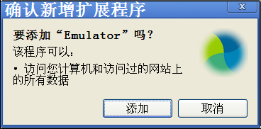
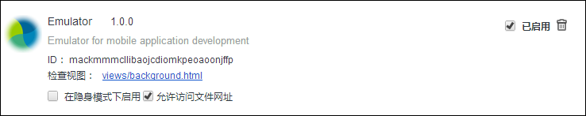

* Auto-generated toc:
{:toc}

## 便携版（推荐）
**以下内容仅适用于Windows**

对于Windows用户，我们推荐使用便携版Chrome_Emulator:

   * 无需手动安装Emulator插件
   * 无需手动为Chrome添加启动参数

### 使用方式
  
   * 下载[PortableEmulator.zip]({{ site.baseurl }}/download/PortableEmulator.zip)并解压到本地（注意：解压路径请不要含有中文字符）
   * 进入解压后Chrome_Emulator所在目录，启动Chrome_Emulator.exe，请参见下图：
   
   
   
   * 在Chrome地址栏中输入应用地址,形如：
   
      * __http://xxx/app/index.html__
      
      * __file:///D:/xxx/app/index.html__

   * 点击Emulator插件图标，选择“Enable”等待页面重新加载

   * 运行Chrome“开发者工具”开始应用调试

## 手动版

**以下内容适用于Windows以及OS X**

手动版要求用户手动安装Emulator并设置Chrome启动参数，具体操作如下：

### Emulator安装

   * 下载并安装最新的Google Chrome浏览器（参考版本：23.0.1271.64）

   * 运行Chrome，在地址栏中输入chrome://chrome/extensions/并打开页面（或通过“工具”->“扩展程序”打开）

   * 下载[ManualEmulator.zip]({{ site.baseurl }}/download/ManualEmulator.zip)并解压到本地,拖动Emulaltor.crx文件到“扩展程序”页面并按照提示安装

       

   * 安装后需勾选“允许访问文件网址”以允许加载file:协议的url（调试本地应用时将使用file:协议）

       

### 应用调试

#### 本地应用调试

   * 确保开启“允许访问文件网址”权限（打开chrome://chrome/extensions/开启）

   * 设置Chrome启动参数：

      * Windows：
         1. 右键单击“Chrome”图标
         1. 选择“属性”并编辑“目标”，在行尾添加参数：　--allow-file-access-from-files --disable-web-security
         1. 编辑后“目标”行形如：chrome.exe --allow-file-access-from-files --disable-web-security

      * OS X：
         1. 运行Terminal.app
         1. 输入： /Applications/Google\ Chrome.app/Contents/MacOS/Google\Chrome --allow-file-access-from-files --disable-web-security

   * 重启Chrome并在Chrome中打开本地应用

   * 点击Emulator插件图标，选择“Enable”等待页面重新加载

   * 运行Chrome“开发者工具”开始应用调试

#### 远端应用调试

   * 运行 Chrome并在地址栏中输入应用地址,如“http://xxx/app/index.html”

   * 点击Emulator插件图标，选择“Enable”等待页面重新加载

   * 运行Chrome“开发者工具”开始应用调试

## 其他说明

   如果安装或使用过程中遇到问题，请参考[FAQ]({{ site.baseurl }}/tools/emulator/FAQ.html)或联系<a href="mailto:opensource@polyvi.com">opensource@polyvi.com</a>，我们会尽快回复您！
  

