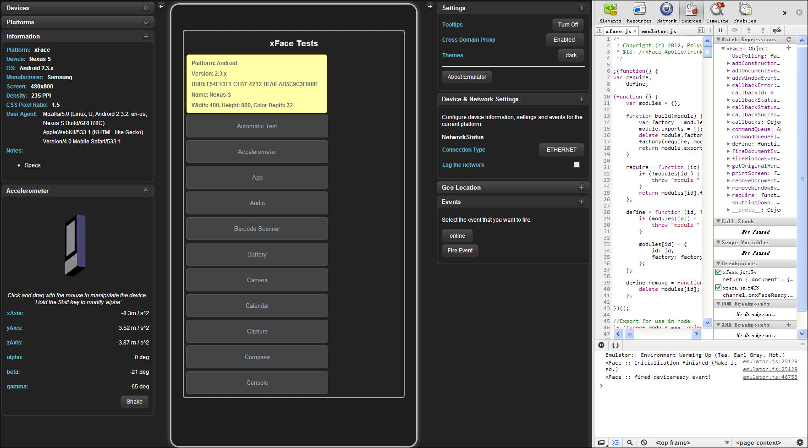

 Emulator实现了对xFace事件以及扩展接口的模拟，主要用于辅助开发人员对web app进行调试。

   将xFace Emulator作为插件安装到Google Chrome后，可以利用Chrome提供的“开发者工具”对应用进行HTML DOM元素审查，JavaScript调试，资源监测，自动化测试等。然而需要应用开发者注意的是：虽然模拟器能够使用丰富的调试工具辅助应用开发，但是它却不能完全取代真机调试工作。

【图：模拟器外观】

