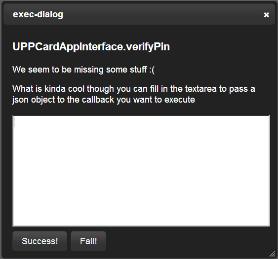

##列表

|扩展|说明|
|:---|:---|
|Accelerometer     |                                                                 |
|AMS	           | 仅支持getStartAppInfo接口                                       |
|Camera            |                                                                 |
|Capture	   |  仅支持captureImage接口                                         |
|Contacts	   |  不支持newContact、chooseContact、displayContact接口            |
|Compass	   |                                                                 |
|Console	   |                                                                 |
|Connection	   |                                                                 |
|Device	           |                                                                 |
|File	           | 部分支持copyTo、moveTo接口                                      |
|Geolocation	   |                                                                 |
|LocalStorage	   |                                                                 |
|Storage	   |                                                                 |
|Setting	   |                                                                 |
|Media	           | 不支持startRecord、 stopRecord、 setVolume接口                  |
|Notification	   |部分支持confirm接口，不支持spinnerDialog、 progressDialog接口    |
|UPPCard相关扩展	   |弹出对话框，由应用开发人员指定扩展执行结果    |
|IdleWatcher	   |调用start接口时，弹出对话框，由应用开发人员指定扩展执行结果    |
|||

##备注

   * 表中没有罗列的扩展接口，模拟器目前都采用空实现
   * 调用空实现的扩展接口时，控制台将输出“xxx is invoked!“语句，例如：

    listInstalledApplications is invoked!
    captureAudio is invoked!

   * 调用UPPCard相关扩展接口时，模拟器将弹出对话框，由应用开发人员指定扩展执行结果

       