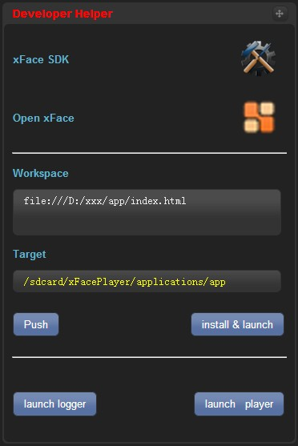

* Auto-generated toc:
{:toc}

##Devices
通过“Devices”面板可以选择iOS或Android设备。不同的设备类型，不仅宽高数据不同，其user agent等设备信息也会有所不同. 另外，通过此面板还可以指定设备朝向，从而查看应用在“横屏”或“竖屏”下的布局.

##Platforms
 通过“Platforms”面板可以选择模拟平台，目前支持的模拟平台有“xFace”以及“Apache Cordova / PhoneGap”.
 
 **当调试本地应用时，切换device/platform将内置xface.js文件到local workspace**
 

##Information

 “Information” 面板用于显示当前模拟器配置相关的信息，如当前平台，设备，OS, 设备屏幕宽高数据，user agent 等.
 

##Accelerometer

 “Accelerometer” 面板可用于模拟设备accelerometer数据，只需点击并拖拽设备图标即可.
 

##Settings

 通过“Settings” 面板可以打开或关闭跨域访问代理, 调整UI主题等.
 

##Device Network Settings

   “Device Network Settings”面板由三部分组成：NetworkStatus, identity, battery.

   * NetworkStatus:可以更改网络连接类型,当网络链接类型由非NONE更改为NONE时，触发offline事件；由NONE更改为非NONE时，触发online事件.

   * identity:当前设备为Android系统时，可以指定IMEI与IMSI的值.

   * battery:通过此面板还可以设置battery状态，当状态改变时将触发battery相关事件.
   

##Geolocation

 “Geolocation” 面板可以模拟地理位置信息.
设置经度、纬度等数据后,可以通过navigator.geolocation.getCurrentLocation()获取.

##Events

  通过“Events”面板可以模拟“online”, “offline” ，“pause”，“resume” 等事件的触发，只需选择事件类型并点击“Fire Event”按钮即可.
    

##Phone

 当前设备为Android系统时，可以通过“Phone”面板模拟“callreceived”事件的触发，只需指定事件携带的status参数并点击“Fire Event”按钮即可.
 

##Messaging

 当前设备为Android系统时，可以通过“Messaging”面板模拟“messagereceived”事件的触发，只需输入事件携带的数据并点击“Fire Event”按钮即可.
 

##Developer Helper

开发人员通过“Developer Helper”面板可以完成如下操作：

   * 快速查看xFace SDK Online
   * 进入xFace开源网站
   
   * 调试本地应用且连接Android设备时，push local workspace下的文件到真机，以更新xFacePlayer应用（目前不支持增量更新）
   * 连接Android设备时，安装xFacePlayer到真机并将其启动
   
   * 连接Android设备时，通过logger查看log信息，并在xFacePlayer已安装的情况下，重新启动真机上的xFacePlayer

