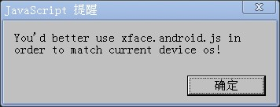
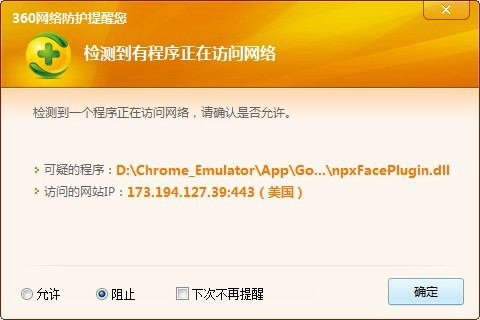
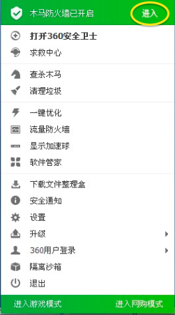

* Auto-generated toc:
{:toc}

### Q：点击Emulator "Enable"选项后，Chrome为何没有重新加载页面 ？

A：请参考以下两点：

   * 查看Chrome路径：Chrome所在路径不能含有中文字符

   * 对于手动安装Emulator的用户，请查看Chrome控制台:

      * 如果控制台输出："FileSystem error: SECURITY_ERR"，请为Chrome设置启动参数：__--allow-file-access-from-files__，否则本地应用将无法正常加载

      * 如果控制台输出："XMLHttpRequest cannot load http://xxx. Origin http://xxx is not allowed by Access-Control-Allow-Origin.", 请为Chrome设置启动参数：__--disable-web-security__,否则某些场景下应用将无法正确获取网络数据

### Q：push操作以及xface.js内置操作为何失败 ？

A：请参考以下六点：

   * push操作以及xface.js内置操作仅在调试本地应用时有效

   * 查看应用路径：本地应用所在绝对路径不能含有中文字符
   
   * 请确保Android设备驱动安装成功
   
   * 请确保Android设备连接状态正常(adb get-state应输出‘device’)
    
   * 请确保Android设备sdcard存在
   
   * 如果看到提示信息"mkdir failed for -p, Read-only file system" "Permission denied", 请确保Android设备sdcard具有写权限
   
### Q：调试应用时，控制台为何输出"Uncaught ReferenceError: xFace is not defined" ?

A：应用根目录下不存在xface.js时，将出现此信息。解决方法如下：

   * 本地应用： 请选择"Devices"面板的"Change Platform"，此操作会将与当前所选设备系统匹配的xface.js拷贝到应用根目录下
      
   * 远端应用：需要应用开发者手动将与模拟器配套发布的xface.js文件放置到应用根目录下。具体操作如下：

      * __如果您选择“Android”系统的设备进行调试，请将xface.android.js重命名为xface.js，并放置在应用根目录下__

      * __如果您选择“iOS”系统的设备进行调试，请将xface.ios.js重名为xface.js，并放置在应用根目录下__
      
### Q：加载页面时，为何弹出"You'd better use xface.android.js（xface.ios.js） in order to match current device os!" ？

   
  
A：如果弹出如上提示框，表明应用根目录下放置的xface.js与当前所选设备系统不匹配。解决方法[同上](#quncaught-referenceerror-xface-is-not-defined-)
      
### Q：点击"install & launch",为何命令行提示"error:devcie not found" ？

   * A：请确保Android设备连接状态正常
      
### Q：点击"launch player",为何命令行提示"Error Type 3" ？

   * A：请先执行"install & launch",将xFacePlayer.apk安装到真机后，再尝试执行"launch player"
   
### Q：使用便携版Chrome_Emulator, 如何阻止360弹出"检测到一个程序正在访问网络"的提示框 ？

   

   * A：使用Chrome_Emulator期间，关闭360"网络安全防护功能"，操作如下：
   
      * 1) 进入"木马防火墙已开启"界面
      
      
      
      * 2) 关闭"系统防御"部分的"网络安全防护"
      
      

### 需要帮助

   如果您的问题还没有解决，请联系<a href="mailto:opensource@polyvi.com">opensource@polyvi.com</a>，我们会尽快回复您！

